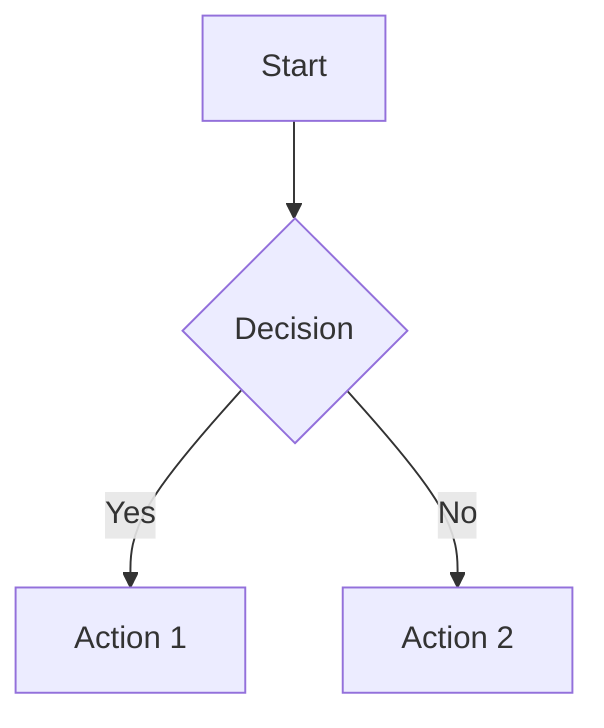
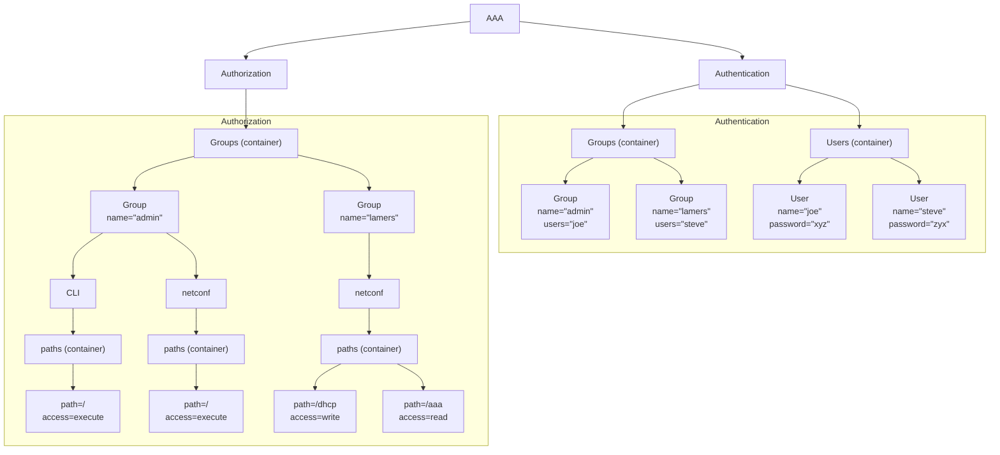

# Ai Ds (2025-05-30)

## getting-started/gitbook-ds/README.md

# Level 1: Main Heading

## Level 2: Tables

### Level 3: Basic Table

| Syntax    | Description |
| --------- | ----------- |
| Header    | Title       |
| Paragraph | Text        |

### Level 3: Aligned Table (GitBook supports this)

| Left-Aligned | Center-Aligned | Right-Aligned |
| :----------- | :------------: | ------------: |
| Cell A       |     Cell B     |        Cell C |
| `code`       |    **bold**    |      _italic_ |

### Table from xml

<table>
    <tr>
        <th>A</th>
        <th>B</th>
        <th>C</th>
    </tr>
    <tr>
        <td>1</td>
        <td>2</td>
        <td>3</td>
    </tr>
    <tr>
        <td>4</td>
        <td>5</td>
        <td>6</td>
    </tr>
    <tr>
        <td>7</td>
        <td>8</td>
        <td>9</td>
    </tr>
</table>

---

## Level 2: Mermaid Diagrams

### Level 3: Flowchart

# Testing rich-qoutes....

It should be easy to annotate:

**Info** Info

**Note** Note

**Tag** Tag

**Comment** Comment

**Hint** Hint

**Success** Success

**Warning** Warning

**Caution** Caution

**Danger** Danger

**Quote** Quote

# Links

- [Creating content - GitBook](https://gitbook.com/docs/creating-content/formatting)

- Added [richqoutes](https://github.com/erixtekila/gitbook-plugin-richquotes)

## getting-started/mermaid/README.md

# Mermaid digrams

During a recent AI-course AI, the topic or re-factoring came up.
Specifically to convert images or drawing to mermaid-syntax.

So I took that opertunity to:

1. Give Gemini an image
2. Ask it to convert it to mermaid syntax

## Result

## Experience

Great! That saves us a lot of time - and we do not have to ask a junior to do
this for us.

The result is pretty good, and other advantages - such as diffing the code
become easier this way.

## GitBook

After issue [Issue 3271](https://github.com/GitbookIO/gitbook/issues/3271) was
fixed - now we can switch between dark- and normal-mode and the rendering looks
good.

## Admonitions

You need to use hints... not very pretty...


**Info hints** are great for showing general information, or providing tips and tricks.



**Success hints** are good for showing positive actions or achievements.



**Warning hints** are good for showing important information or non-critical warnings.



**Danger hints** are good for highlighting destructive actions or raising attention to critical information.


## Links

- [Mermaid Gitbook Examples](https://raw.githubusercontent.com/mermaidjs/mermaid-gitbook)

