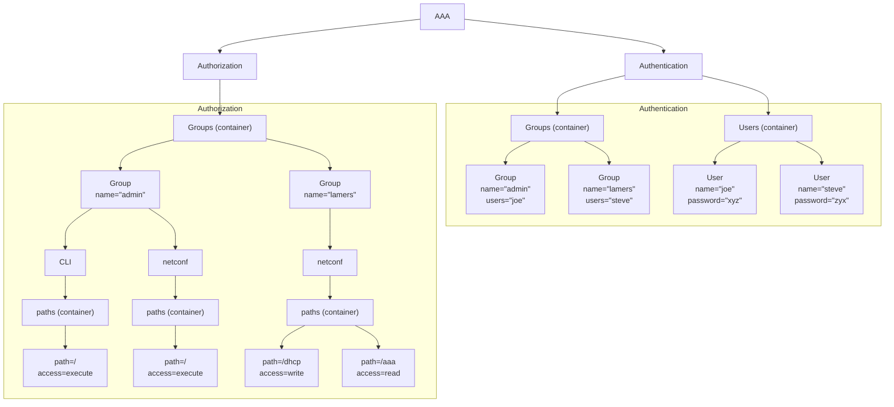

# Ci (2026-04-22)

Included file: by-date/2026/04/22-ci_assets/inject_snippets.py

Included file: by-date/2026/04/22-ci_assets/inject-snippets.yml

## getting-started/gsl-example/README.md

# Generator Scripting Language - teaching Gemini

First of all a shout-out to the [GSL](https://github.com/zeromq/gsl)-tool.
It is fantastic, simple, robust and after you get the hang of it - extremely addictive.

Please read more about it - and about its author [Pieter Hintjes](https://en.wikipedia.org/wiki/Pieter_Hintjens).

During a recent course AI was explained and someone mentioned that
Gemini performs better then DeepSeek and ChatGPT in coding tasks.

So I took that opertunity to:

1. Teach Gemini about [GSL](https://github.com/zeromq/gsl)
2. Provide the README.txt file as context
3. Explain what I wanted, and asked it to generate some artifacts.

## The assignment

I want to teach you about GSL, more context is provided here: [README.txt](https://github.com/zeromq/gsl/blob/master/README.txt).

Ask: Write an entities.xml file which contains some entities with typical fields such as name,age etc.

Gemini produced: 

### entities.xml

<!-- include: entities.xml lang=xml -->
<!-- /include -->

After this I requested it to write the gsl-template to generate, on the basis of the entity-format C-structs.

### entity_generator.gsl
The resulting template after some back and forth looks like this:

<!-- include: entity_generator.gsl lang=c -->
<!-- /include -->

I then asked it to generate a main.c file and a Makefile in order to compile the entire example:

### main.c

<!-- include: main.c -->
<!-- /include -->

### Makefile

<!-- include: Makefile lang=makefile -->
<!-- /include -->

## Generated artifacts

As this should be a generic entity-generator, this first template generates C-code.
This might not be the cleanest code, however a 'seasoned' C-developer would be able
to provide a working version, which contains best practices for memory-management etc.

This working example could easily be taking by AI or a Human/AI - Centaur to generate
templates for other languages.

So, here come the generated artifiacts.

### Person.h

<!-- include: Person.h -->
<!-- /include -->

### Person.c

<!-- include: Person.c -->
<!-- /include -->

## Conclusions

1. Gemini is better at this then the other solutions I tried. It outperformes DeepSeek ( which I think is really good!)
2. Gemini might get stuck on a certain issue - for instance - in the templates, the code which needs to be generated should not have a dot as first character.
3. C-code might be better, but leave it to experts ( humanzzzz ) to provider better examples which we can incorporate.

## getting-started/mermaid/README.md

# Mermaid digrams

During a recent AI-course AI, the topic or re-factoring came up.
Specifically to convert images or drawing to mermaid-syntax.

So I took that opertunity to:

1. Give Gemini an image
2. Ask it to convert it to mermaid syntax

## Result

## Experience

Great! That saves us a lot of time - and we do not have to ask a junior to do
this for us.

The result is pretty good, and other advantages - such as diffing the code
become easier this way.

## GitBook

After issue [Issue 3271](https://github.com/GitbookIO/gitbook/issues/3271) was
fixed - now we can switch between dark- and normal-mode and the rendering looks
good.

## Admonitions

You need to use hints... not very pretty...


**Info hints** are great for showing general information, or providing tips and tricks.



**Success hints** are good for showing positive actions or achievements.



**Warning hints** are good for showing important information or non-critical warnings.



**Danger hints** are good for highlighting destructive actions or raising attention to critical information.


## Links

- [Mermaid Gitbook Examples](https://raw.githubusercontent.com/mermaidjs/mermaid-gitbook)

